#  Sly Multi Trainer

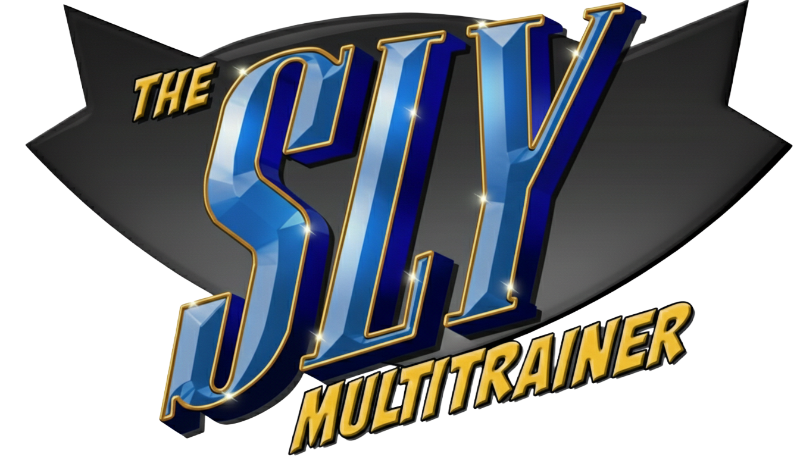

## 📖 Description
Sly Multi Trainer is a trainer for the Sly Cooper original trilogy principally developed by [NiV-L-A](https://github.com/NiV-L-A). It supports the [PCSX2](https://pcsx2.net/) and [RPCS3](https://rpcs3.net/) emulators.

With Sly Multi Trainer, you can experiment with the internal parameters of the Sly Cooper trilogy, understand how things work under the hood, study the games’ inner mechanics, or simply have fun forcing behaviors that would be impossible in the original game without an external tool.

Please, refer to the [Changelog](https://raw.githubusercontent.com/NiV-L-A/SlyMultiTrainer/refs/heads/master/SlyMultiTrainer-Changelog.txt) for information about changes for each version.

>[Download now](https://github.com/NiV-L-A/SlyMultiTrainer/releases/latest)

### Video showcase
>https://www.youtube.com/watch?v=nfF_uditjxA

## 📸 Screenshots

### Sly Multi Trainer with Sly Cooper and the Thievius Raccoonus / Sly Raccoon
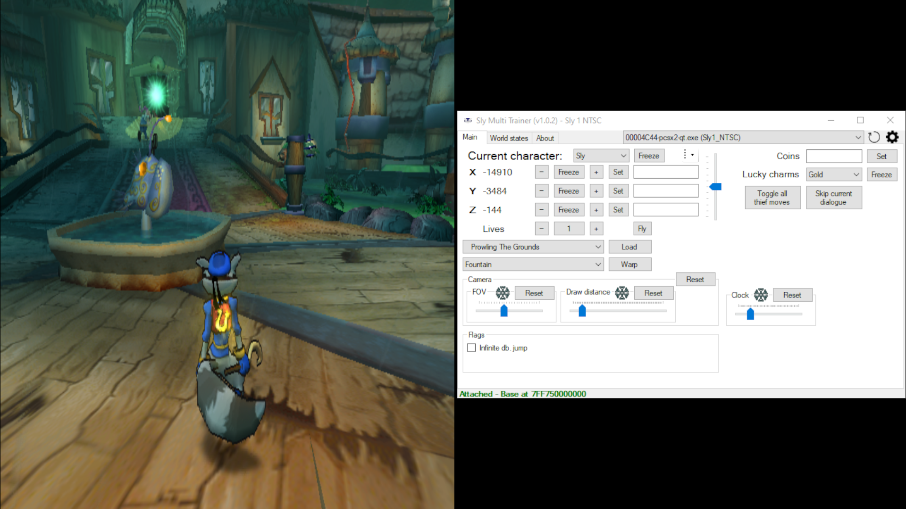 

### Sly Multi Trainer with Sly 2: Band of Thieves
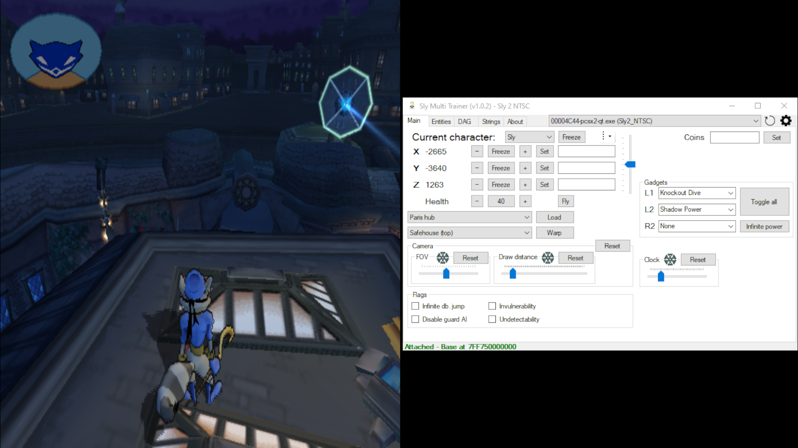 

### Sly Multi Trainer with Sly 3: Honor Among Thieves
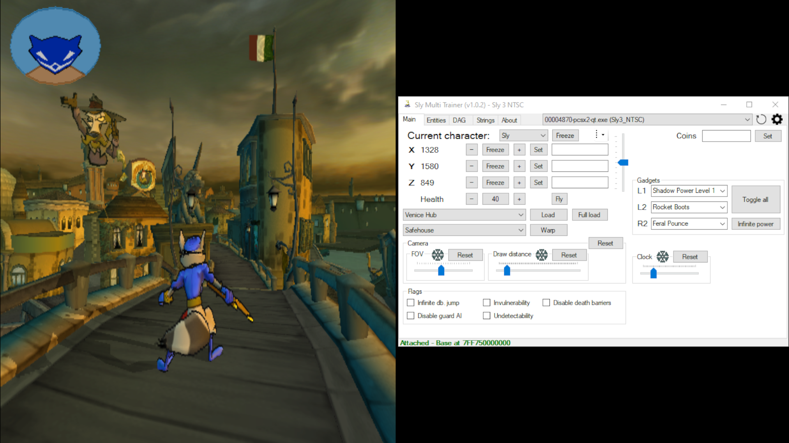 

## ⚙️ Supported builds
|         Game          |                 Region                  | Short-format build date |   Serial   |   CRC    |
| :-------------------: | :-------------------------------------: | :---------------------: | :--------: | :------: |
|         Sly 1         |                  NTSC                   |        0824.2206        | SCUS-97198 | C77AF2CA |
|         Sly 1         |                   PAL                   |        1121.2105        | SCES-50917 | DA3DD765 |
|         Sly 1         |                 NTSC-J                  |        0131.1715        | SCPS-15036 | 15C88C7B |
|         Sly 1         |                 NTSC-K                  |        1231.1308        | SCKA-20004 | 71017DE1 |
|         Sly 1         |                NTSC Demo                |        0408.2044        | SCUS-97210 | EF7F0CE6 |
|         Sly 1         |                PAL Demo                 |        1206.1234        | SCED-51452 | F3FD8A14 |
|         Sly 1         |               NTSC-J Demo               |        1219.2129        | PAPX-90231 | 9C29F787 |
|         Sly 1         |               NTSC-K Demo               |        1219.2129        | SCKA-90004 | 9CB33FB5 |
|         Sly 1         |               NTSC May 19               |        0519.1812        | SCUS-97198 | 515E82DE |
|         Sly 2         |                  NTSC                   |        0813.0032        | SCUS-97316 | 07652DD9 |
|         Sly 2         |               PAL (v1.00)               |        0914.1846        | SCES-52529 | FDA1CBF6 |
|         Sly 2         |               PAL (v2.01)               |        1006.2123        | SCES-52529 | 15DD1F6F |
|         Sly 2         |                 NTSC-J                  |        0121.1144        | SCPS-15090 | 615EA2DB |
|         Sly 2         |                 NTSC-K                  |        1221.1745        | SCKA-20044 | 518DD841 |
|         Sly 2         |              NTSC E3 Demo               |        0411.1757        | SCUS-97415 | 5B93397F |
|         Sly 2         | NTSC PlayStation Magazine Demo Disc 089 |        0920.1827        | SCUS-97457 | B3E892E4 |
|         Sly 2         |            PAL September 11             |        0911.1830        | SCES-52529 | B89723F2 |
|         Sly 2         |              NTSC March 17              |        0317.1405        | SCUS-97198 | DD0B5E6C |
|         Sly 2         |              NTSC July 11               |        0711.1656        | SCUS-97316 | A480549C |
|         Sly 2         |              PAL August 2               |        0802.1031        | SCES-52529 | 4BE9708A |
|         Sly 3         |                  NTSC                   |        0828.0212        | SCUS-97464 | 8BC95883 |
|         Sly 3         |                   PAL                   |        0921.1843        | SCES-53409 | 8164C614 |
|         Sly 3         |                 NTSC-K                  |        1112.1525        | SCKA-20063 | A8CC1583 |
|         Sly 3         |              NTSC E3 Demo               |        0418.1711        | SCUS-97484 | 3130A4D3 |
|         Sly 3         |            NTSC Regular Demo            |        0707.2044        | SCUS-97527 | 35CCFA60 |
|         Sly 3         |                PAL Demo                 |        0906.1452        | SCED-53802 | BAE3B5E9 |
|         Sly 3         |              NTSC July 16               |        0716.1854        | SCUS-97464 | 0190CF8B |
|         Sly 3         |              PAL August 2               |        0802.0136        | SCES-52529 | 8C146034 |
|         Sly 3         |             PAL September 2             |        0902.1747        | SCES-53409 | 3670B6F9 |
|         Sly 1         |             NTSC (PS3 PSN)              |        0906.1415        | NPUA80663  |      -    |
|         Sly 1         |              PAL (PS3 PSN)              |        1103.1309        | NPEA00341  |      -    |
|         Sly 1         |            NTSC-K (PS3 PSN)             |        1129.1638        | NPHA80174  |      -    |
|         Sly 2         |             NTSC (PS3 PSN)              |        0524.2241        | NPUA80664  |      -    |
|         Sly 2         |              PAL (PS3 PSN)              |        0524.2241        | NPEA00342  |      -    |
|         Sly 2         |            NTSC-K (PS3 PSN)             |        0524.2241        | NPHA80175  |      -    |
|         Sly 3         |             NTSC (PS3 PSN)              |        1222.1218        | NPUA80665  |      -    |
|         Sly 3         |              PAL (PS3 PSN)              |        1222.1218        | NPEA00343  |      -    |
|         Sly 3         |            NTSC-K (PS3 PSN)             |        1222.1218        | NPHA80176  |      -    |
|  The Sly Collection   |                  NTSC                   |             -            | BCUS98246  |      -    |
|    The Sly Trilogy    |                   PAL                   |             -            | BCES00968  |      -    |
|    The Sly Trilogy    |                   UK                    |             -            | BCES00982  |      -    |
| Sly Cooper Collection |                 NTSC-J                  |             -            | BCJS30061  |      -    |

## 🚀 How to run and use
>[!IMPORTANT]
> *[.NET Desktop Runtime 10.0 x64](https://dotnet.microsoft.com/en-us/download/dotnet/10.0)* must be installed in order to run this program. 

- The program ***may need to be ran as administrator***.
- The program automatically detects the PCSX2/RPCS3 process and the game build.
- A combobox is available to target a specific valid process if more than one is detected.
- Program options change depending on the detected build.
  - For example, for all Sly 1 builds a "Lucky charms" combobox is present, but it is not present for all Sly 2 and Sly 3 builds.
  - This also applies to builds of the same game: for example, a checkbox control is present for the build `Sly 2 NTSC` which toggles the guards AI but it is not present for `Sly 2 NTSC E3 Demo`.

## 📚 Features
- Load maps
- Warp to pre-defined locations
- Edit coins
- Edit and freeze the camera's FOV
- Edit and freeze the camera's draw distance
- Edit and freeze the game's clock
- Edit and freeze health/lives
- Edit and freeze the current character's coordinates
- A tool strip menu with the following items:
  - Copy XYZ to textboxes
  - Copy XYZ to clipboard
  - Paste XYZ from clipboard
  - Set XYZ
- Change the active character through the "Current character" combobox
  - To actually change the character, the map needs to be reloaded
  - For Sly 3, the combobox only shows the characters that are available in the current map (e.g. only Sly is available in the Police Station of Episode 1)
- Fly mode
  - Press the "Fly" button to enable and press it again to disable
  - Hold cross to go up, hold circle to go down and hold L1 to accelerate
  - It is possible to change the controller binds in the app's settings by clicking on the gear icon
- A trackbar is present to edit the amount to add to the coordinates when pressing the "-" and "+" buttons. The trackbar is also used for the speed when the fly mode is enabled
- Toggle all gadgets/thief moves
- Infinite gadget power
- Modify gadget binds
- Disable guards AI
- Invulnerability
- Undetectability
- Infinite double jump
- Disable death barriers
- Skip current dialogue
- A button to re-initialize the application. This has the same effect as closing and opening the application
- A button to modify some of the application's settings and behavior
- Sly 1: World states tab
  
  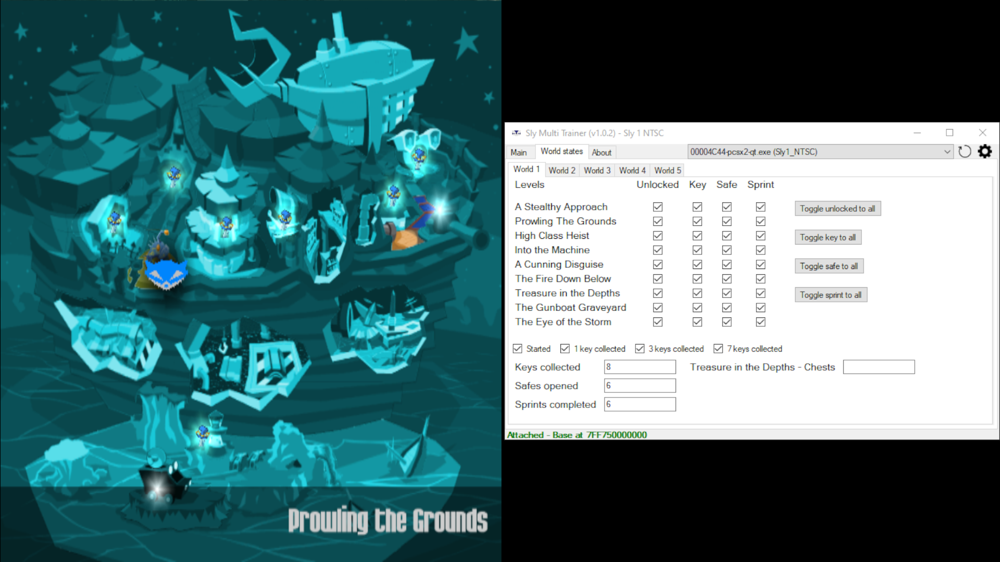
  
  - 5 sub-tabs for each world
  - Edit each world's "Started", "1 key collected", "3 keys collected" and "7 keys collected" flags
  - Edit each world's "Keys collected", "Safes opened" and "Sprints completed" values
  - Edit each level's "Unlocked", "Key", "Safe" and "Sprint" flags
  - World 1
    - Edit "Treasure in the Depths - Chests"
  - World 2
    - Edit "At the Dog Track - Nitros"
    - Edit "At the Dog Track - Laps"
  - World 3
    - Edit "Piranha Lake - Fish"
    - Edit "Piranha Lake - Torch"
    - Edit "Down Home Cooking - Chicken"
  - World 4
    - Edit "A Desperate Race - Nitros"
    - Edit "A Desperate Race - Laps"
  - World 5
    - Edit "Burning Rubber - Fire slugs computer"
    - Edit "Burning Rubber - Computer"
    - Edit "Bentley Comes Through - Chip"
- Sly 2 & 3: FK$X objects viewer tab
  
  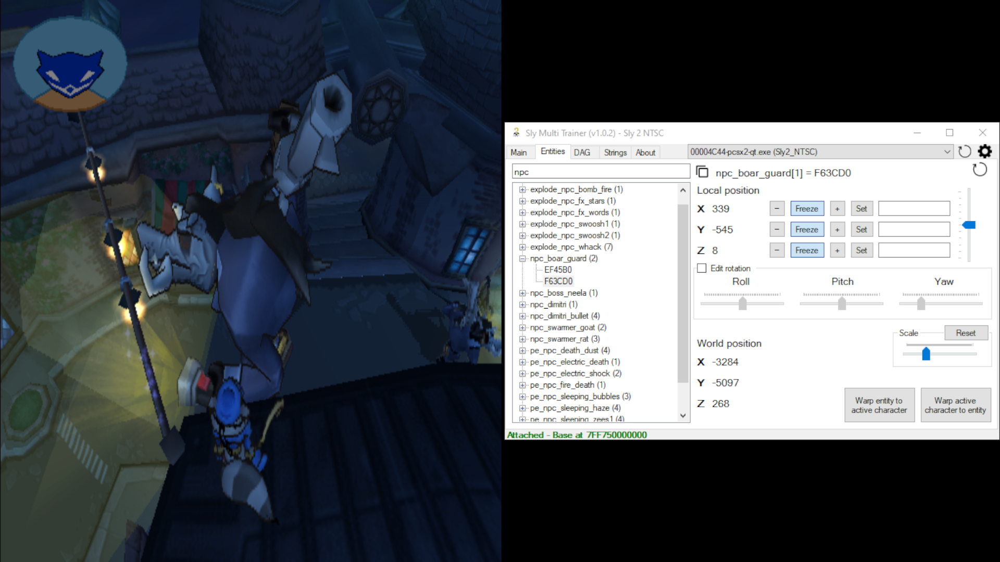
  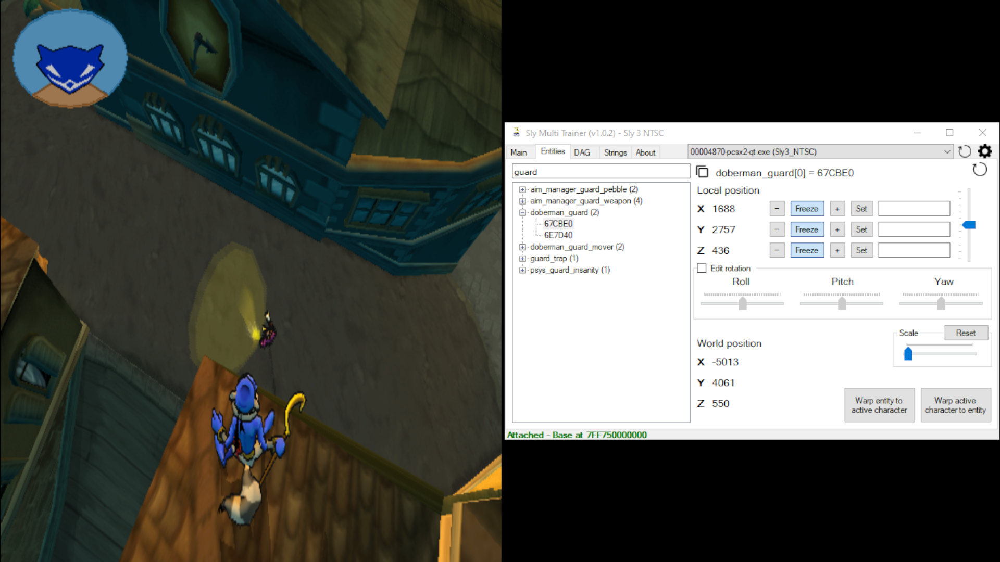
  
  - Populated on map change
  - "Refresh" button to force reading the game's memory again to parse the FK$X objects list
  - Search bar to filter through the list
    - The search function filters through the entities' names and entities' addresses.
  - When a node is selected:
    - The address of the selected entity is shown and is able to be copied to the clipboard
    - Depending on the entity's properties, it might be possible to edit its local transformation (position, rotation and scale)
    - Show world (final) position
    - Warp the active character to the selected entity
- Sly 2 & 3: Interactive DAG viewer tab
  
  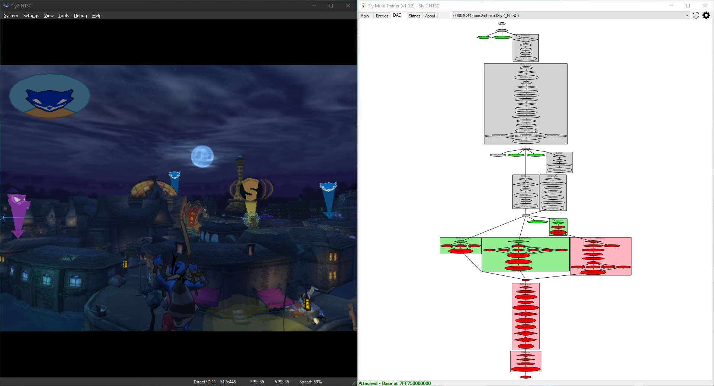
  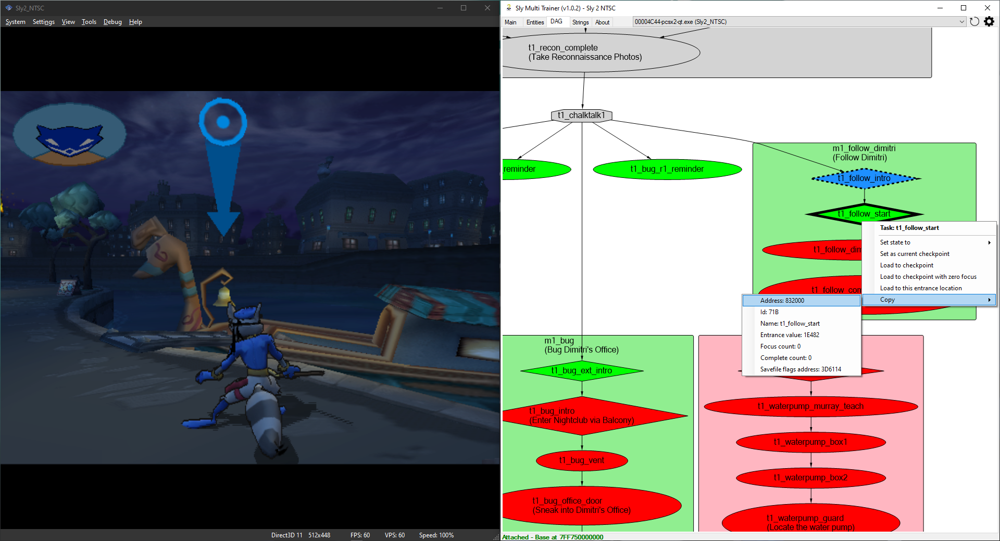
  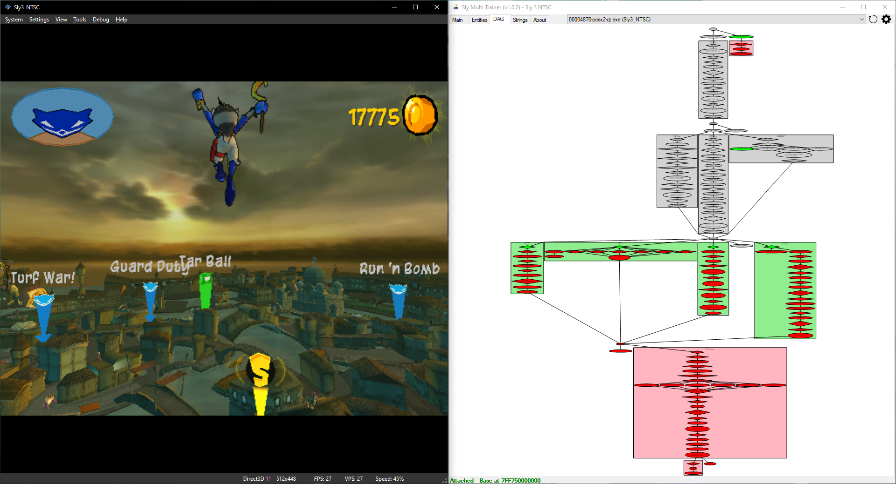
  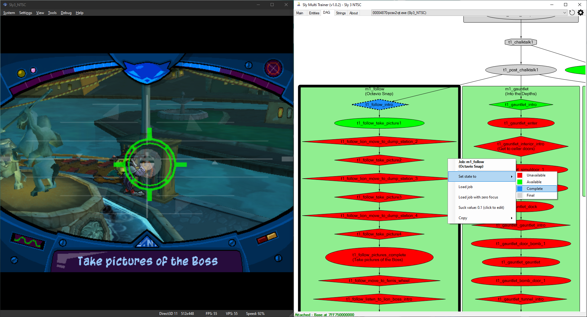
  
  - Populated on map change
  - Might take some moments to show
  - Mouse wheel to zoom-in and zoom-out
  - Hold left click and drag to pan
  - Right click on the graph
    - Shows the number of tasks parsed
    - Go to root: goes to the root node of the DAG
    - Restore pan and zoom: restores the user's transformation to fit the current DAG's size
    - Settings (requires refresh)
      - Lock pan and zoom on refresh: if checked, on map change or if the user clicks "Refresh", the viewer will not assume the default graph's transformation
      - Show name: show the node's name
      - Show address: show the node's address
      - Show id: show the node's id
      - Show id as decimal: show the node's id as decimal instead of hexadecimal
    - Refresh: force reading the game's memory again to parse the DAG
    - Save as png...: save the graph as a png file
  - Right click on a task
    - Set state to
      - Unavailable, Available, Complete or Final
    - Copy (to clipboard)
      - Address
      - Id
      - Name
      - Focus count
      - Complete count
      - Savefile flags address
        - For Sly 2 NTSC March 17 and Sly 2 NTSC E3 Demo:
          - Array of 3 integers, in which
            - The first indicates if the task has been in a "complete" state (internally called "is_complete")
            - The second is "Focus count" (copied to the task's struct on map loading)
            - The third is the state (copied to the task's struct on map loading)
        - For all the other builds:
          - Array of 5 integers, in which:
            - The first is "Focus count" (copied to the task's struct on map loading)
            - The second is "Complete count" (copied to the task's struct on map loading)
            - The third indicates if the task has been in a "complete" state (internally called "is_complete")
            - The fourth is the state (copied to the task's struct on map loading)
            - The fifth is internally called "from_memcard"
      - Goal description (only if the node has a goal description)
      - Entrance value (only if the node is a checkpoint)
    - If the node is a checkpoint there are 3 more options:
      - Set as current checkpoint
      - Load to checkpoint
      - Load to checkpoint with zero focus
      - Load to this entrance location
  - Right click on a job
    - Set state to
      - Unavailable, Available, Complete or Final
    - Load job
    - Load job with zero focus
    - Suck value (click to edit)
    - Copy
      - Address
      - Id
      - Name
      - Description
      - Savefile flags address
        - For Sly 2 NTSC March 17 and Sly 2 NTSC E3 Demo:
          - Array of 2 integers, in which
            - The first is the number of attempts (internally called "focus_count")
            - The second indicates if the job has been completed (internally called "is_complete")
        - For all the other builds:
          - Array of 2 integers and 2 floats, in which:
            - The first is the number of attempts (internally called "focus_count")
            - The second indicates if the job has been completed (internally called "is_complete")
            - The third is the playtime (internally called "time_played")
            - The fourth is the suck value (internally called "suck_value")
  - Double left click on a checkpoint task
    - Load to checkpoint (with Shift pressed: Load to checkpoint with zero focus)
  - Double left click on a job
    - Load job (with Shift pressed: Load job with zero focus)
- Sly 2 & 3: Strings tab
  
  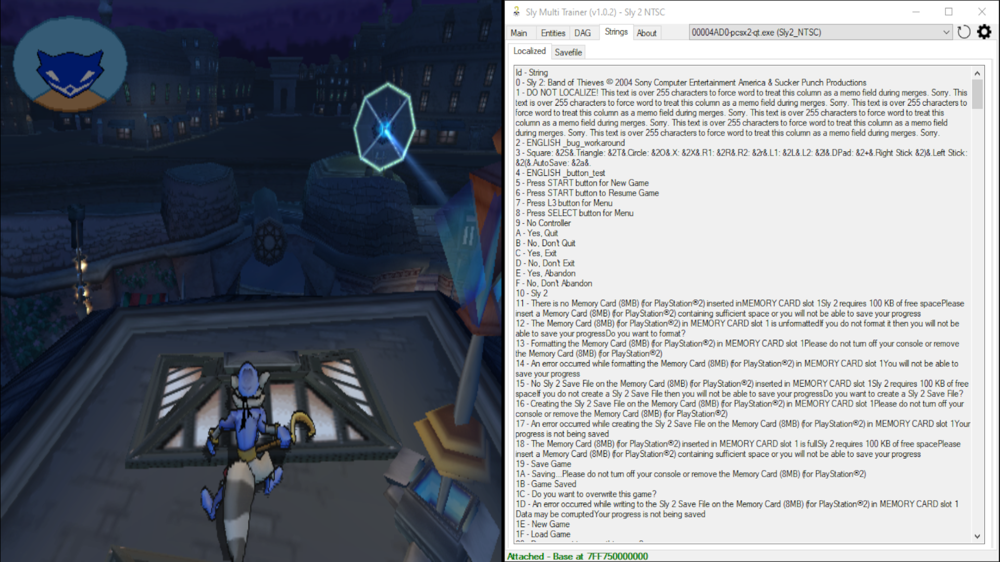
  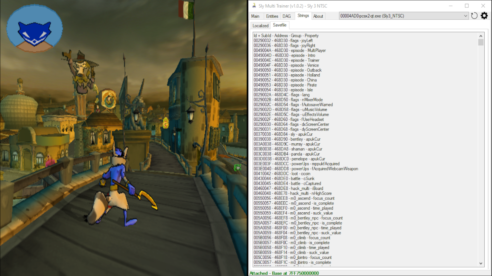
  
  - A tab that contains 2 sub-tabs:
    - "Localized" tab:
      - Populated on map change
      - These strings are localized on non-english versions of the games
      - Each entry represents the string id and the string itself, separated by a "-" symbol
      - NOTE: The app internally sorts the list by string id
    - "Savefile" tab:
      - Each entry represents a field in the savefile region
      - NOTE: The app internally sorts the list by address
- "About" tab
  - Credits
  - Addresses list used for the current build

## 📒 Planned features
- General
  - Custom warps
  - Dark mode
  - Tab index
  - Hide HUD
- Sly 1
  - Disable guards AI
  - Invulnerability
  - Undetectability
- Sly 1 NTSC Demo
  - Fov
- Sly 1 NTSC May 19
  - World states
- Sly 2
  - Skip dialogue
- Sly 2 NTSC E3 Demo
  - Disable guards AI
  - Invulnerability
  - Undetectability
- Sly 2 NTSC March 17
  - Invulnerability
  - Undetectability
- Sly 2 NTSC July 11
  - Invulnerability
  - Undetectability
- Sly 3
  - Skip dialogue
  - Other characters (e.g. Carmelita)
- Sly 3 NTSC E3 Demo
  - Disable death barriers
- Sly 3 NTSC July 16
  - Undetectability
- Entities
  - Rotation doesn't always work
- DAG
  - Find a flag to indicate that a task is a chalktalk (to apply the octagon shape). Right now it uses a regex pattern
  - Progress bar when loading?
  - Some edges should be straight but aren't (sly 2 ntsc ep1, satellite sabotage into breaking and entering)
  - Cluster's label should be center aligned
  - Graph->Settings without refreshing (this works for nodes, but msagl doesn't have a way to resize the cluster to the new node sizes, which would also mean extend or shrink the edges)
  - Let the user change values of a node (map id, entity id, etc...)
  - "Continue lineup" function from the debug menu
  - "Force episode complete" function from the debug menu
  - Search node function (search by address, id, etc...)
  - For Sly 2, the option "Load to this entrance location" could actually be warping without reloading. The entrance value of a checkpoint is the id (the field at +0x18) of an entrance struct. For Sly 2 NTSC, the first entrance struct is pointed at by the address 0x3E06C0 (calculated from 3DD490 + 3038 + 2A * C).  
    Function stack: address 0x3E06C0 calculated by the function at 15E3A8 called from 15EB74. Instruction at 15EBB8 stores to the stack an array of entrance struct pointers, which was requested by the instruction at address 22803C. The rest of the function goes through the array of entrance structs and checks if the field at +0x18 is the same as the requested entrance value. When found, the transformation matrix is at +0x60

## 😬 Known issues
- Sly 3 NTSC Regular Demo
  - Gadget binds for L2 and R2 don't work
- DAG
  - Sly 2
    - Loading the task in Episode 1 "t1_bug_intro" without focus will try to play the binocucom dialogue immediately (and also, failing to do so)
    - Loading the task in Episode 2 "t2_steal_tuxedo_intro" will not play the binocucom dialogue after walking inside the hotel
    - Loading the task in Episode 7 "t7_laser_outside" without focus will not play the binocucom dialogue, which will cause the first crystal to not be interactable
    - Loading the task in Episode 7 "t7_bearcave_intro_int" without focus will not play the binocucom dialogue, which will cause the radio transmitters to not be pickable
    - Loading the task in Episode 7 "t7_bearcave_back_outside" without focus will play the binocucom dialogue while sly is still crawling outside the bearcave
  - Sly 3
    - Loading the task in Episode 4 "t4_van_defend_pkturret_intro" with the Grapple-Cam gadget already acquired will make the gang's van not appear
    - NTSC July 16:
      - Loading some checkpoints forces the game to load with 3D screen enabled
    - NTSC Regular Demo:
      - Loading some checkpoints forces the game to load with 3D screen enabled
    - PAL August 2:
      - Loading some checkpoints forces the game to load with 3D screen enabled

## 🛠️ Build instructions
Sly Multi Trainer uses a [modified version of memory.dll](https://github.com/NiV-L-A/memory.dll) to facilitate the development of the program. 
The modifications add additional data types for read and write operations and a custom way to deal with addresses, offsets and pointers.

1. Clone the SlyMultiTrainer repository by clicking on the "Code" button and selecting "Open with Visual Studio"
2. Download the memory.dll source code from [this fork of memory.dll](https://github.com/NiV-L-A/memory.dll) by clicking on the "Code" button and selecting "Download ZIP"
3. Extract the memory.dll-master.zip archive
4. In Visual Studio, in the Solution Explorer window, right click on the SlyMultiTrainer solution, select "Add" and then "Existing project..."
5. Select the "Memory.csproj" file from the extracted memory.dll-master.zip archive
6. In the Solution Explorer window, expand the SlyMultiTrainer project entry, right click on "Dependencies" and select "Add Project Reference..."
7. On the left side select "Projects", add the "Memory" item and make sure its checkbox is checked. Click OK
8. Visual Studio should recognize the file and the project should accept the "Memory" namespace
9. Run the application by clicking on "Debug" and then "Start Debugging"

>[!NOTE]
>Do note that debug symbols are not emitted when in "Release" mode. To actually debug the application (e.g. set breakpoints) make sure to be in "Debug" mode

## 🛩️ Release workflow
1. In the Solution Explorer window, right click on the SlyMultiTrainer project entry, go to "Properties", "Package" and increase the "Package Version"
2. Run the application and make sure the window's title reflects the new package version
3. Remove unused using directives
4. Change changelog
5. In the Solution Explorer window, right click on the SlyMultiTrainer project entry and select "Publish". Use the following settings and then click "Publish":
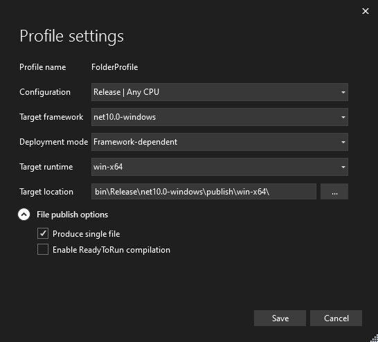

## 📜 Credits & Thanks
- [NiV-L-A](https://github.com/NiV-L-A)
- [TheOnlyZac](https://github.com/TheOnlyZac)
- [fr4nk0](https://github.com/fr4nk014)
- [SlyCooperReloadCoded](https://github.com/SlyCooperReloadCoded)
- [Néo Foderé de Frutos](https://github.com/neofodere)
- Sly Cooper Modding Discord Server: https://discord.gg/2GSXcEzPJA
- memory.dll: https://github.com/NiV-L-A/memory.dll
- Microsoft Automatic Graph Layout: https://github.com/microsoft/automatic-graph-layout

**Sly Multi Trainer is a fan project and is not affiliated with, endorsed by, or in any way connected to Sucker Punch Productions, PlayStation Studios or Sony**
